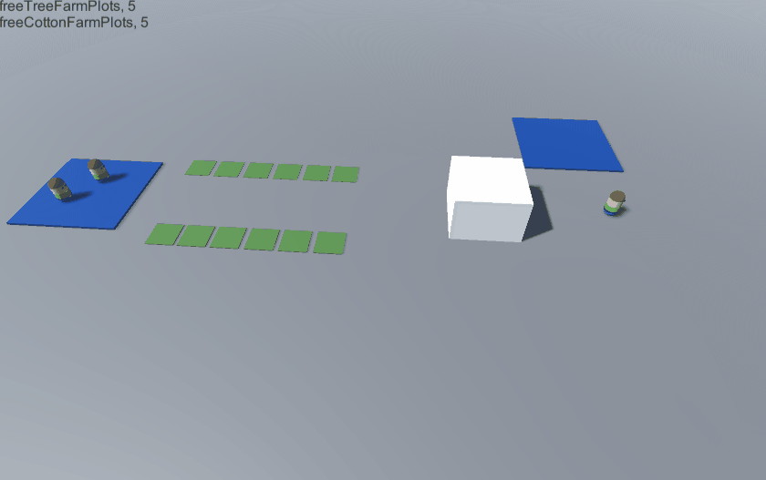

# Portfolio
# Author: Felipe Andrés Álvarez Avaria (alu0100969535@ull.edu.es)

## Goal-Oriented Action Planning

This project is a simple Unity Project using the GOAP AI technic to control character behavior.

It can be found in github in the following link: https://github.com/alu0100969535/GOAP-FarmExport

### Agents

In this project there are 3 types of agents, two farmers and one truck loader.
The farmers can farm either cotton or wood and retrieve the resources to the barn. 

When the barn has some resources and a truck is waiting, the loader will attempt to carry it to the truck.
Additionally, agents will prioritize resting when they are exhausted, when they are relieved they get back to work again.

* CottonFarmer ([CottonFarmerAgent.cs](https://github.com/alu0100969535/GOAP-FarmExport/blob/main/Assets/FarmExport/Agents/CottonFarmerAgent.cs))
* TreeFarmer ([TreeFarmerAgent.cs](https://github.com/alu0100969535/GOAP-FarmExport/blob/main/Assets/FarmExport/Agents/TreeFarmerAgent.cs))
* TruckLoader ([TruckLoaderAgent.cs](https://github.com/alu0100969535/GOAP-FarmExport/blob/main/Assets/FarmExport/Agents/TruckLoaderAgent.cs))

### Places

There are some places that the agents can interact with:

* FarmPlots ([FarmPlotBase.cs](https://github.com/alu0100969535/GOAP-FarmExport/blob/main/Assets/FarmExport/Places/FarmPlotBase.cs))
  * CottonFarmPlot ([CottonFarmPlot.cs](https://github.com/alu0100969535/GOAP-FarmExport/blob/main/Assets/FarmExport/Places/CottonFarmPlot.cs))
  * TreeFarmPlot ([TreeFarmPlot.cs](https://github.com/alu0100969535/GOAP-FarmExport/blob/main/Assets/FarmExport/Places/TreeFarmPlot.cs))
* Barn ([Barn.cs](https://github.com/alu0100969535/GOAP-FarmExport/blob/main/Assets/FarmExport/Places/Barn.cs))
* Truck ([Truck.cs](https://github.com/alu0100969535/GOAP-FarmExport/blob/main/Assets/FarmExport/Places/Truck.cs))

### Actions

There are a total of 9 actions arranged the following way:

* Plant ([PlantActionBase.cs](https://github.com/alu0100969535/GOAP-FarmExport/blob/main/Assets/FarmExport/Actions/PlantActionBase.cs))
  * Tree ([PlantTreeAction.cs](https://github.com/alu0100969535/GOAP-FarmExport/blob/main/Assets/FarmExport/Actions/PlantTreeAction.cs))
  * Cotton ([PlantCottonAction.cs](https://github.com/alu0100969535/GOAP-FarmExport/blob/main/Assets/FarmExport/Actions/PlantCottonAction.cs))
* Collect (Gather from plot) ([CollectFarmActionBase.cs](https://github.com/alu0100969535/GOAP-FarmExport/blob/main/Assets/FarmExport/Actions/CollectFarmActionBase.cs))
  * Wood ([CollectTreeFarmAction.cs](https://github.com/alu0100969535/GOAP-FarmExport/blob/main/Assets/FarmExport/Actions/CollectTreeFarmAction.cs))
  * Cotton ([CollectCottonFarmAction.cs](https://github.com/alu0100969535/GOAP-FarmExport/blob/main/Assets/FarmExport/Actions/CollectCottonFarmAction.cs))
* Barn deposit ([BarnActionBase.cs](https://github.com/alu0100969535/GOAP-FarmExport/blob/main/Assets/FarmExport/Actions/BarnActionBase.cs))
  * Wood ([BarnDepositWoodAction.cs](https://github.com/alu0100969535/GOAP-FarmExport/blob/main/Assets/FarmExport/Actions/BarnDepositWoodAction.cs))
  * Cotton ([BarnDepositCottonAction.cs](https://github.com/alu0100969535/GOAP-FarmExport/blob/main/Assets/FarmExport/Actions/BarnDepositCottonAction.cs))
* Barn take ([BarnActionBase.cs](https://github.com/alu0100969535/GOAP-FarmExport/blob/main/Assets/FarmExport/Actions/BarnActionBase.cs))
  * Wood ([BarnTakeWoodAction.cs](https://github.com/alu0100969535/GOAP-FarmExport/blob/main/Assets/FarmExport/Actions/BarnTakeWoodAction.cs))
  * Cotton ([BarnTakeCottonAction.cs](https://github.com/alu0100969535/GOAP-FarmExport/blob/main/Assets/FarmExport/Actions/BarnTakeCottonAction.cs))
* Load truck (both resources) ([LoadTruckAction.cs](https://github.com/alu0100969535/GOAP-FarmExport/blob/main/Assets/FarmExport/Actions/LoadTruckAction.cs))
* Rest (all agents) ([Rest.cs](https://github.com/alu0100969535/GOAP-FarmExport/blob/main/Assets/Hospital/Rest.cs))

Each of the actions has its own set of rules to be able to start them.
For example to be able to plant a tree there is needed a free plot for the tree to plant and to deposit in the barn the agent has to be carrying some resources to deposit.

There are other conditions such as the loader cannot start the loading task if there is no truck waiting or the farmers cannot bring the resources to the barn until they are full.

### Visuals
Both the tree and cotton plots have visual states, so in green is available to plant on them, on red something is growing and when either cotton or tree has grown up, it will appear as so.
The barn and truck are simple cubes without materials but the functionality still works.

### Execution gif
